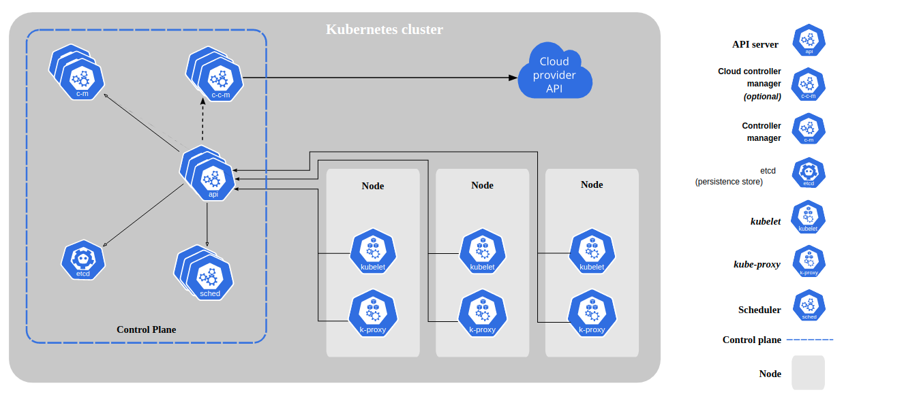
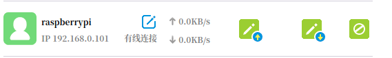
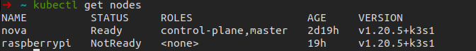
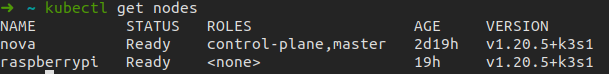

# 搭建树莓派K3S集群

## 一、背景知识

首先需要介绍k8s，一个 Kubernetes 集群由一组被称作节点的机器组成。这些节点上运行 Kubernetes 所管理的容器化应用。集群具有至少一个工作节点。工作节点托管作为应用负载的组件的 Pod 。控制平面管理集群中的工作节点和 Pod 。 为集群提供故障转移和高可用性，这些控制平面一般跨多主机运行，集群跨多个节点运行。

这张图表展示了包含所有相互关联组件的 Kubernetes 集群。



每一个节点需要安装一个kubelet和k-proxy。

[文档链接](https://kubernetes.io/zh/docs/concepts/overview/components/)


k3s相比与k8s更加轻量化。一个机器安装k3s后会自动安装kubectl等工具，且适用于低配置的arm平台。

k3s包括两个角色，agent和server。agent标识worker，server表示master。

```flow
	开始=>start: 开始                                  //定义一个开始模块
    结束=>end: 结束                                    //定义一个结束模块
    过程1=>operation: 处理过程1:>https://www.baidu.com  //定义过程1: 点击后连接到百度
    过程2=>opertaion: 处理过程2
    条件1=>condition: 大于等于0？
    输入=>inputoutput: 输入一个数                       //定义一个输入输出模块
    输出1=>inputoutput: 输出这个数
    输出2=>inputoutput: 输出这个数*-1
    st=>start: 开始
    block1=>operation: 在所有的节点安装k3s(master, worker1,worker2,...,workern)
    block2=>operation: 得到master的ip和token
    block3=>operation: 启动worker agent
    block4=>operation: 在master查看所有节点状态
    ed=>end: 结束
    
    
st->block1->block2
block2->block3->block4->ed


    
  
    
    

开始->输入->条件1(yes)->输出1->结束
条件1(no)->输出2(right)->结束


```


## 二、准备条件

一个master，一个worker节点。

master和worker的ip为

| name    | ip            |
| ------- | ------------- |
| master  | 192.168.0.102 |
| worker1 | 192.168.0.101 |

worker1节点通过路由器界面查看:




## 三、安装k3s

在master和worker节点安装k3s，安装指令如下:

```bash
curl -sfL https://get.k3s.io | sh -
```

安装后会自动运行k3s服务，我们先选择关闭。

```bash
systemctl stop k3s
```


## 四、搭建集群

1. 首先在master节点运行k3s服务，这里一定要使用server参数。

   ```bash
   #启动sever
   sudo k3s server docker
   ```
   
   然后查看节点:
   
   ```bash
   kubectl get nodes
   ```
   
   
   
   可以看到当前server一共注册了两个节点，只有一个master在Ready状态。查看master的token为:
   
   ```bash
   sudo cat /var/lib/rancher/k3s/server/node-token
   K10d5bc3b9d97a1a226f1946f3854caf0aad3af04f510ee4d0c662f04b0f2563b95::server:c0ca9584db27db7fa43e4991d7cf032e
   ```
   
   


2. 在worker节点运行k3s服务，首先用ssh登录到worker节点

   ```bash
   ssh pi@192.168.0.101
   #password: raspberry
   ```

   然后启动k3sagent服务，(也可以设置k3s-agent服务自启动)
   
   ```bash
   sudo k3s agent --server https://192.168.0.102:6443 \
   --token \
   K10d5bc3b9d97a1a226f1946f3854caf0aad3af04f510ee4d0c662f04b0f2563b95::server:c0ca9584db27db7fa43e4991d7cf032e
   ```
   
   这里启动agent一共用了两个参数:
   
   | 参数     | 意义                                               |
   | -------- | -------------------------------------------------- |
   | --server | 主节点的url，用https方法                           |
   | --token  | 上面查看的master的token值，这个值用来标识token的id |
   
   在master查看节点:
   
   
   
   


## 五、部署应用

todo


## 参考链接

1. [k3s官方文档](https://docs.rancher.cn/docs/k3s/_index)
2. [使用 K3s 在树莓派上运行 Kubernetes 集群 ](https://zhuanlan.zhihu.com/p/120171512)
3. [轻量级Kubernetes之k3s：12:部署一个nginx的应用](https://blog.csdn.net/liumiaocn/article/details/103342443)

